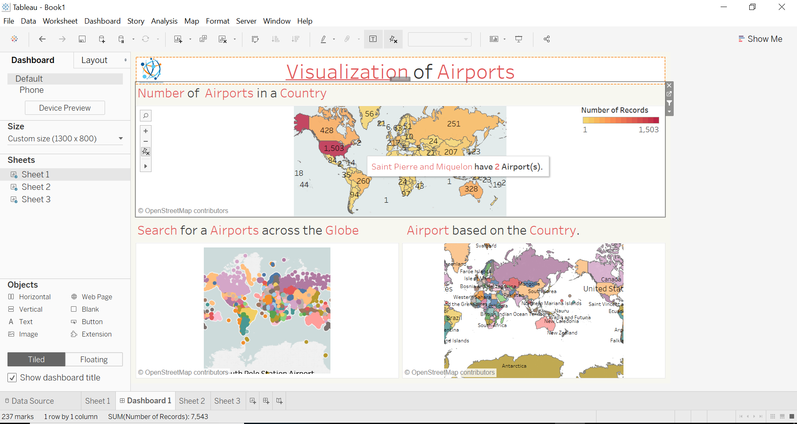
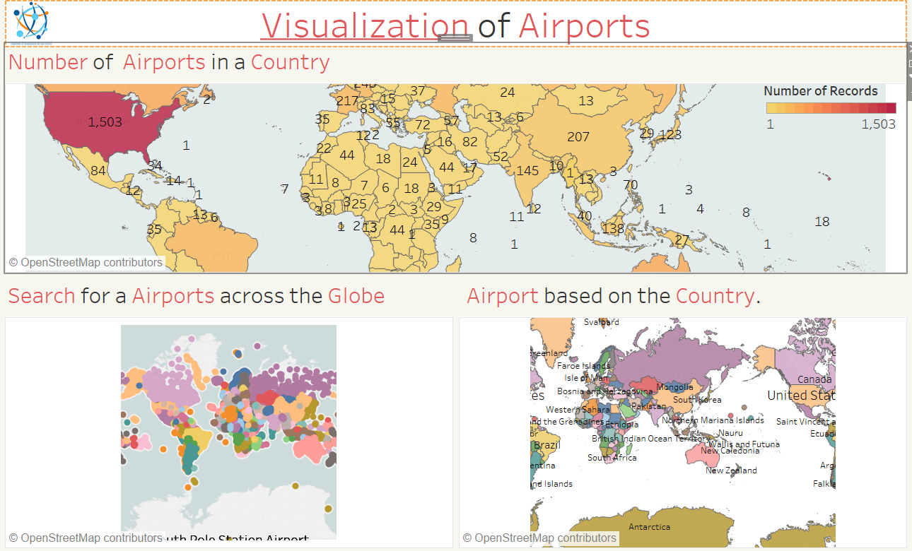
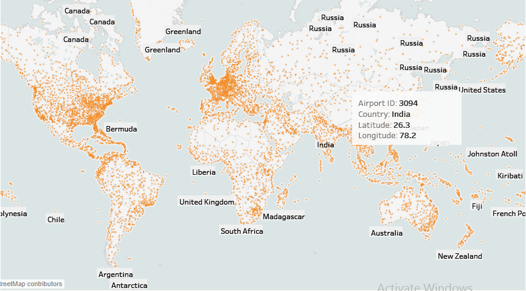
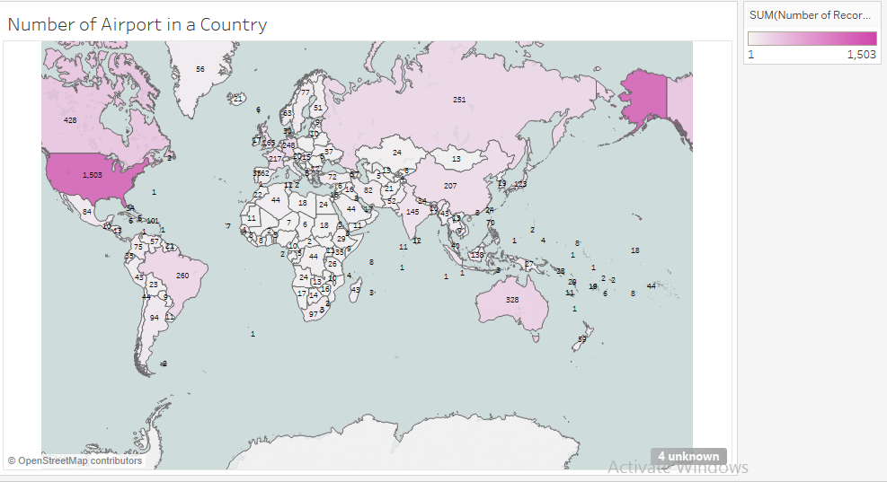
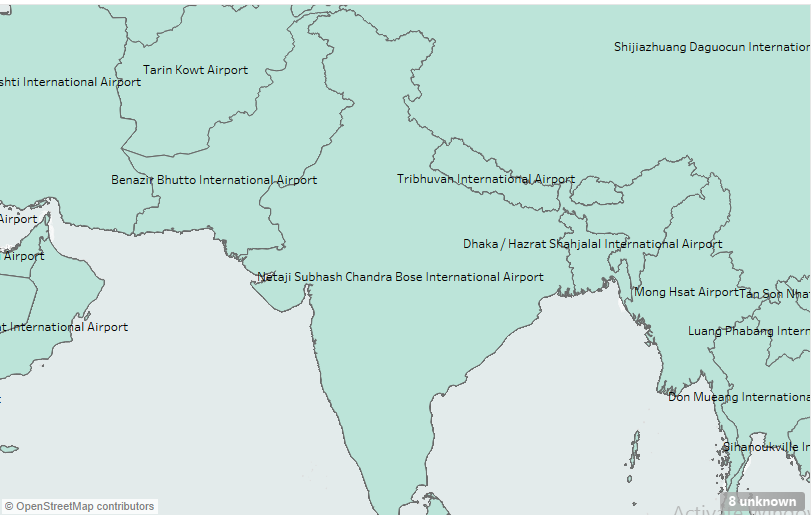
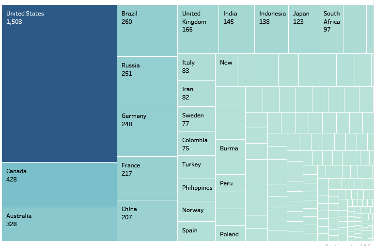
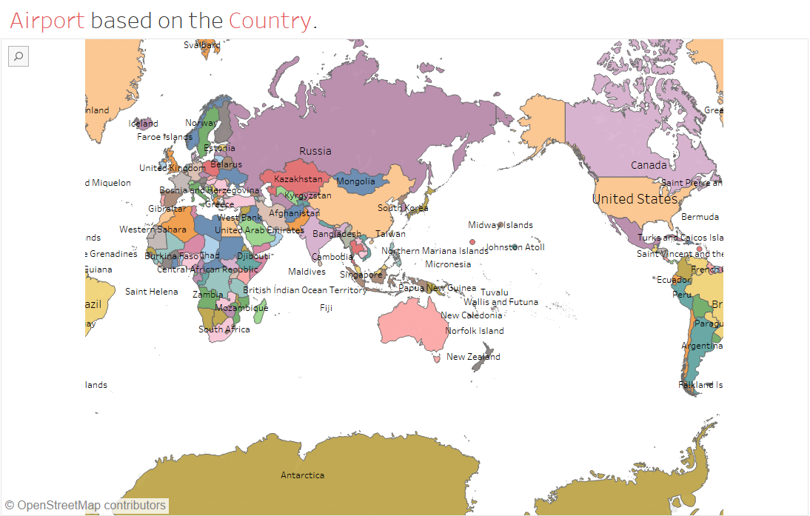
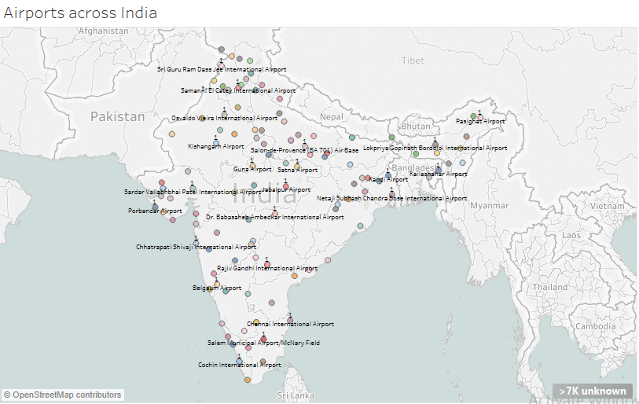

# LAT-LONG-Mapping-Visualization-of-Airport-across-the-Globe
## Data Analysis and visualization project

## Abstract
I always like the idea of organizing, managing and mapping big data into a more beautiful visual. So in this
project, I am going to implement the idea of plotting the location based on latitude, longitude, and altitude into
the 3D-space and show the visualization of the data across the world so to get some instinct how we are
connected to the different parts of the world. The goal is to make an interactive platform so that we can get
information about the airport within a country and the nearest airport based on some location.

## Features want to incorporate into this project

* Visualization of the airport distribution across the globe.
* As it is interactive, will also show the information about the airport like timezone, name, country etc..just on the click.
* Search based query about the airport.
* Nearest airport based on the location (latitude,longitude).

## Dataset 

Airport dataset from openflights.org (OpenFlights: Airport and airlines Data).
As of January 2017, the OpenFlights Airports Database contains over 10,000 airports spanning the
globe. Each entry contains the following information:
AirportID,Name,City,Country,IATA,ICAO,Latitude,Longitude,Altitude,
Timezone,DST,Tz,Type
Sample entries:
507,"London Heathrow Airport","London","United Kingdom","LH
R","EGLL",51.4706,-0.461941,83,0,"E","Europe/London","airpor
t","OurAirports"
3127,"Pokhara Airport","Pokhara","Nepal","PKR","VNPK",28.200
899124145508,83.98210144042969,2712,5.75,"N","Asia/Katmand
u","airport","OurAirports"

source: https://raw.githubusercontent.com/jpatokal/openflights/master/data/airports.dat
(https://raw.githubusercontent.com/jpatokal/openflights/master/data/airports.dat)

## Visualization Tool:

1. Implemented with Tableau.
2. If time permits then I would also like to show the visualization of air traffic across the globe.

# Tableau Dashboard Interface:

# Results:

